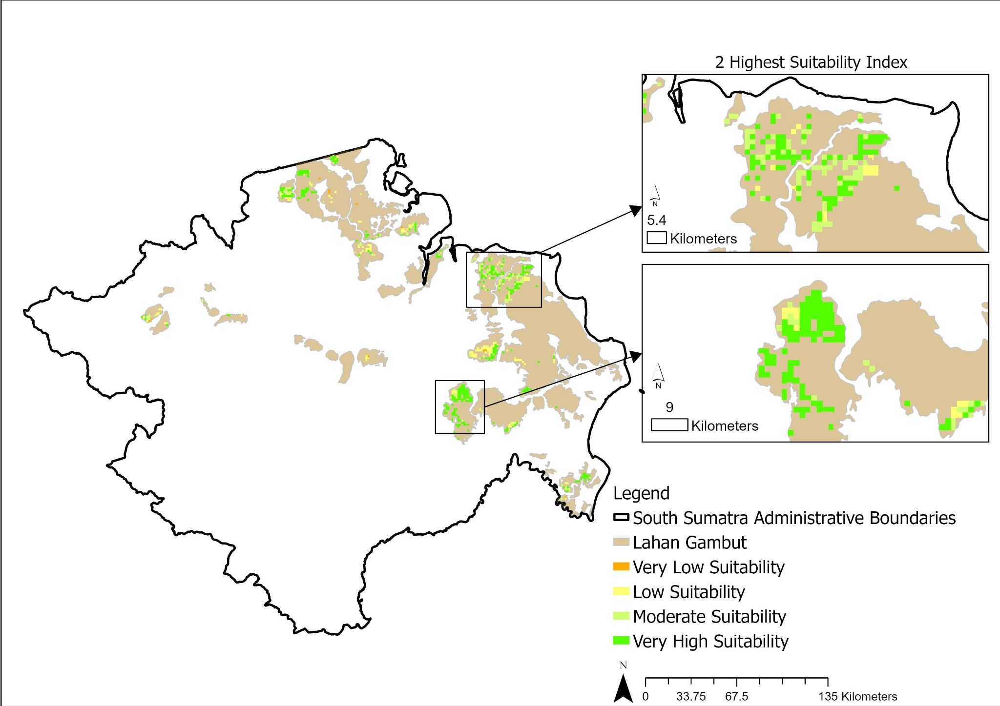
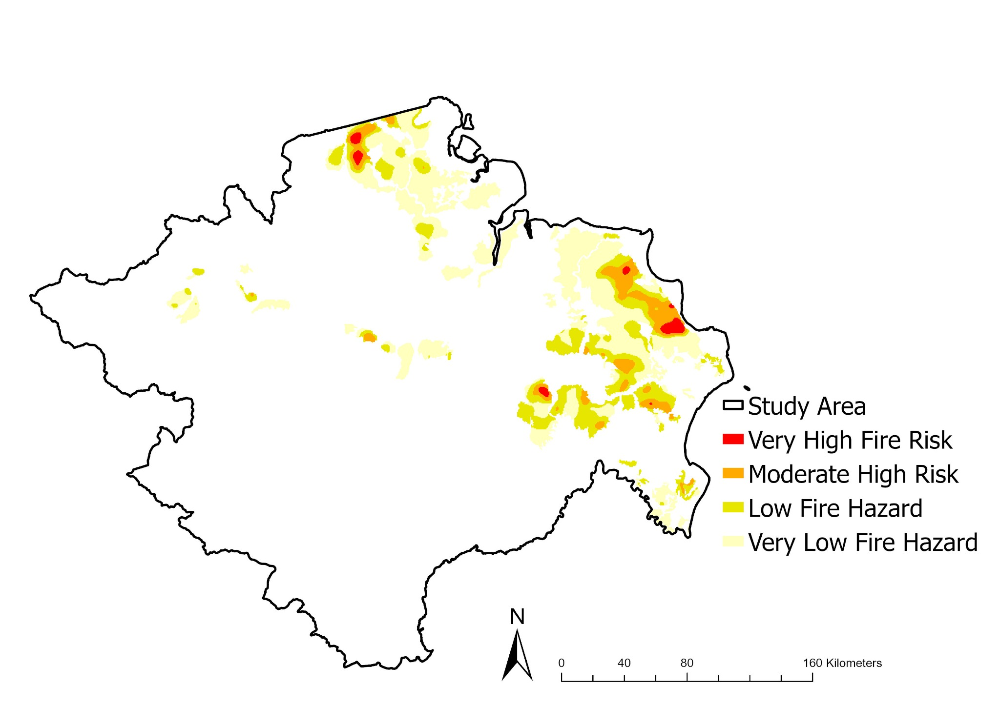

# Degraded Peatland Agrivoltaic Suitability

GIS–MCDA-based land suitability analysis for agrivoltaic development on degraded peatlands in South Sumatra, Indonesia.



## Overview

This repository presents a GIS-based multi-criteria decision analysis framework for screening degraded peatlands in South Sumatra for potential agrivoltaic development. The project integrates peatland-specific risk factors, accessibility, terrain variables, and solar resource data to identify candidate zones while avoiding ecologically sensitive or restricted areas.

The analysis was developed in ArcGIS Pro and is accompanied by a structured ArcPy reconstruction scaffold, exported thematic maps, and an interactive project dashboard.

## Why this project matters

Peatlands in South Sumatra face recurring fire risk, seasonal flooding, drainage-related instability, and land degradation. At the same time, the region has meaningful solar potential. This project explores whether degraded peatlands can be screened for agrivoltaic development without encouraging expansion into intact peat ecosystems.

## Core idea

This is a **risk-first agrivoltaic siting framework**. Rather than prioritising irradiance alone, the analysis first considers fire hazard, peat depth, flood vulnerability, and topographic feasibility. Solar resource acts as an additional suitability factor after major ecological and constructability filters are applied.

## Key results

Of the **230,810 ha** of degraded peatland in South Sumatra, **124,008 ha** remained after protected-area constraints were applied. Within that eligible domain:

| Class | Area (ha) | Share |
|---|---:|---:|
| Highly suitable | 66,665.25 | 53.76% |
| Moderately suitable | 30,867.84 | 24.89% |
| Low | 24,408.99 | 19.69% |
| Very low | 2,065.68 | 1.67% |

Overall, **78.65%** of eligible degraded peatland was classified as moderately suitable or highly suitable for agrivoltaic development.

## Dashboard

An interactive project dashboard is available in the [`dashboard/`](dashboard/) folder. It provides a visual overview of the suitability results, AHP-derived criterion weights, peatland domain context, analytical pipeline, and a switchable map explorer for all 12 thematic layers.

**To open it:** download [`dashboard/index.html`](dashboard/index.html) and open it in any browser. No install or build tools required.

## Methods

The workflow was developed in ArcGIS Pro using a GIS–MCDA approach with:

- Common spatial grid: 30 m
- Projected coordinate system: WGS 84 / UTM Zone 48S (EPSG:32748)
- Analytic Hierarchy Process (AHP) for criterion weighting
- Weighted Linear Combination (WLC) for suitability integration
- Protected areas (WDPA) and related exclusions as hard constraints

## Evaluation criteria

Eight criteria were integrated through AHP pairwise comparison (CR = 0.00244):

| Criterion | Weight | Direction | Source |
|---|---:|---|---|
| Fire hazard (FRP-weighted KDE) | 0.1965 | Cost | NASA FIRMS (VIIRS 375 m) |
| Peat depth / geotechnical proxy | 0.1781 | Cost | BBSDLP / Ministry of Agriculture |
| Flood vulnerability index | 0.1599 | Cost | BNPB InaRISK Geoservices |
| Slope | 0.1412 | Benefit | BIG DEM |
| Distance to roads | 0.1216 | Benefit | OpenStreetMap / Geofabrik |
| Global Horizontal Irradiance | 0.1099 | Benefit | Global Solar Atlas v2 |
| Aspect | 0.0573 | Benefit | BIG DEM |
| Topographic Position Index | 0.0355 | Benefit | BIG DEM |

Risk factors (fire, peat, flood) collectively account for **53.5%** of the total weight, reflecting the risk-first design philosophy.

## Study area

South Sumatra, Indonesia.



## Repository structure

```
degraded-peatland-agrivoltaic-suitability/
├── dashboard/           ← Interactive project dashboard (open index.html)
│   ├── index.html
│   └── app.jsx
├── scripts/             ← ArcPy workflow scaffold (12 steps + helpers)
│   ├── 00_env_setup.py
│   ├── 01_prepare_study_area.py
│   ├── ...
│   ├── 11_export_maps.py
│   ├── run_pipeline.py
│   └── _helpers.py
├── config/              ← Project configuration and AHP weights
├── docs/                ← Methods, data sources, limitations
├── outputs/
│   ├── figures/         ← 12 thematic and suitability maps
│   └── tables/          ← Weights, area statistics, metadata
├── results/             ← Key findings summary
├── data/                ← Input data placeholders and metadata
└── arcgis-pro/          ← ArcGIS Pro project notes
```

## Reproducibility note

The Python workflow in this repository is a structured ArcPy implementation of the project logic. The `config/project_config.json` uses example input paths and is intended as a template for adaptation. Users who wish to rerun or adapt the workflow should replace those paths with their own local datasets and confirm field names, schemas, and processing assumptions.

This repository should be understood as a **public project showcase plus adaptable workflow template**, not as a fully plug-and-play rerun package.

## Publication status

This project is based on a study that has been accepted for publication but is not yet formally published. A formal citation and DOI will be added after publication.

## Limitations

- The original analysis was developed in ArcGIS Pro through a GUI-led workflow and later translated into a structured ArcPy scaffold.
- Some original source datasets are not redistributed directly in this repository.
- The final suitability map is a screening product and should not be treated as final engineering approval or site investment advice.
- Field validation, hydrological checks, geotechnical feasibility, land tenure review, and grid connection assessment are still required for implementation decisions.

## Author

**Muaffan Alfaiz Wisaksono**
Precision Agriculture / GIS / Environmental Spatial Analysis
Lincoln University

## License

[MIT](LICENSE)
